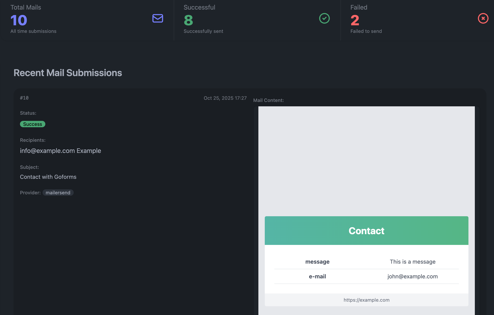

# GoForms

> Open-source, self-hosted HTML form to email service - A secure alternative to AirForms, JotForms, and FormSpree.

GoForms allows you to handle HTML form submissions and send them as emails without writing any backend code. All sensitive data is encrypted at rest.

# Warning

This is a pet project to learn Go and develop a service that comes in handy when dealing with HTML forms and email.

## Features

- **🔒 Security First**: All form data encrypted at rest with AES-256-GCM
- **🛡️ Spam Protection**: Google reCAPTCHA integration
- **🌍 Multi-language**: Support for Dutch, French, and English (easily extensible)
- **📧 Multiple Mail Providers**: MailerSend support with extensible provider architecture
- **🔑 API Authentication**: PBKDF2-based API key authentication for admin endpoints

## Quick Start

A **postgres** backend, you can run **docker-compose up** to have an example working demo:

```
docker-compose up
```

The application will be available at `http://localhost:30000`.

Send form data to your configured endpoint:

```bash
curl -X POST http://localhost:30000/forms/<form-id> \
   -H "Content-Type: application/x-www-form-urlencoded" \
   -d "name=John Doe&email=john@example.com&message=Hello World"
```

Or via HTML

```html
<form action="http://localhost:30000/forms/<form-id>" method="POST">
  <input type="text" name="name" placeholder="Your Name" required>
  <input type="email" name="email" placeholder="Your Email" required>
  <textarea name="message" placeholder="Your Message" required></textarea>
  <div class="g-recaptcha" data-sitekey="your-recaptcha-site-key"></div>
  <button type="submit">Send Message</button>
</form>
```

Then you can view the mails via API

```
curl http://localhost:30000/api/mails -H "Authorization:Bearer changeme"
```

Or via an [admin page](http://localhost:30000/admin?apiKey=changeme).



### Configuration

Forms are configured in `config.yaml`:

```yaml
forms:
  - id: "form-id>"
    provider: mailersend
    name: "Contact Form"
    subject: "New Contact Form Submission"
    sender:
      email: noreply@yourdomain.com
      name: "Your Website"
    recipients:
      - email: contact@yourdomain.com
        name: "Contact Team"
```


## Development

### Available Commands

```bash
# Development
make run          # Start development server with hot reload
make css          # Watch and build Tailwind CSS
make test         # Run all tests
make lint         # Run golangci-lint

# Database
make migrate      # Run database migrations
make sqlgen       # Generate SQL code from queries

# Deployment
make compose      # Run with docker-compose
make serve        # Run via Docker locally
make deploy       # Deploy to Kubernetes
```

### Database Migrations

Create a new migration:
```bash
go run . --new-migration
```

Apply migrations:
```bash
make migrate
```

### Testing

Run tests with Ginkgo:
```bash
make test        # Run all tests
make testr       # Auto-run tests on file changes
```
